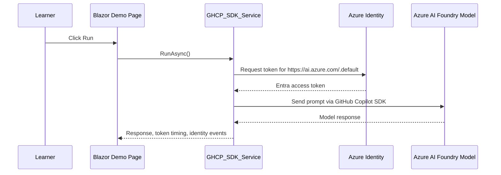

# GHCP SDK Managed Identity Demo

This repo is a small, friendly demo for learning how GitHub Copilot, the GitHub Copilot CLI, the GitHub Copilot SDK, Azure Managed Identity, and Azure AI Foundry can work together without storing model keys in your app.

The short version: click **Run**, watch the app acquire an Entra token, send a prompt through the GitHub Copilot SDK to a Foundry-hosted model, and see the response plus the Azure Identity SDK events that happened along the way.

It is a tiny app with a big idea: keys are not the main character. Identity is.

## What This Demonstrates

- A .NET 10 Blazor web app that calls a Foundry model from a single page.
- `DefaultAzureCredential` choosing the right identity for the environment.
- Local development with Azure CLI credentials.
- Azure hosting with managed identity.
- The GitHub Copilot SDK `BearerTokenProvider` pattern for bring-your-own-model scenarios.
- Azure Identity SDK event capture, so learners can see how token acquisition behaves.

## The Flow



## Project Tour

| Path | Why it matters |
| --- | --- |
| `src/web/Program.cs` | Registers Razor components and the demo service. |
| `src/web/Services/GHCP_SDK_Service.cs` | The heart of the demo: acquires the token, configures the Copilot SDK session, calls Foundry, and captures Azure Identity events. |
| `src/web/Components/Pages/Home.razor` | The single-page learner experience with the Run button, response cards, and event table. |
| `src/web/appsettings.json` | Safe placeholder configuration showing the settings this demo expects. |
| `src/web/Properties/launchSettings.json` | Local launch profiles that use Azure CLI credentials. |
| `infra/Bicep` | Azure infrastructure modules for deploying the surrounding app resources. |

## Prerequisites

- .NET 10 SDK
- Azure CLI
- Access to an Azure AI Foundry resource and model deployment
- An Entra identity that can invoke the Foundry model
- GitHub Copilot access if you want to explore the repo with GHCP and the CLI

## Local Setup

1. Sign in to Azure:

   ```powershell
   az login
   ```

1. Create or update `src/web/appsettings.Development.json` with your own values:

   ```json
   {
     "Azure": {
       "EntraTenantId": "00000000-0000-0000-0000-000000000000",
       "FoundryResourceUrl": "https://your-foundry-resource.services.ai.azure.com",
       "ModelName": "your-model-deployment-name",
       "TokenScope": "https://ai.azure.com/.default"
     },
     "Demo": {
       "Prompt": "Explain managed identity like I am new to Azure."
     }
   }
   ```

1. Run the app:

   ```powershell
   cd src/web
   dotnet run
   ```

1. Open the URL from the terminal, then click **Run**.

The launch profiles set `AZURE_TOKEN_CREDENTIALS` to `AzureCliCredential`, which keeps local authentication explicit. That means your local run uses the Azure CLI login instead of a secret stored in the app.

## Running In Azure

When hosted in Azure, the same service can use managed identity instead of Azure CLI credentials.

At a high level:

1. Deploy the web app infrastructure.
1. Enable a system-assigned or user-assigned managed identity for the app.
1. Grant that identity permission to invoke the Foundry model.
1. Configure app settings using double underscores for nested config keys:

   ```text
   Azure__EntraTenantId=<tenant-id>
   Azure__FoundryResourceUrl=https://your-foundry-resource.services.ai.azure.com
   Azure__ModelName=<model-deployment-name>
   Azure__TokenScope=https://ai.azure.com/.default
   Demo__Prompt=Tell me why managed identity is useful.
   AZURE_TOKEN_CREDENTIALS=ManagedIdentityCredential
   ```

If you use a user-assigned managed identity, also set:

```text
AZURE_CLIENT_ID=<managed-identity-client-id>
```

## GitHub Actions

The [bicep-build-deploy-webapp.yml](.github\workflows\bicep-build-deploy-webapp.yml) will deploy the app using Bicep.  Before running the action, you must [set up some GitHub environment variables](.github\CreateGitHubSecrets.md).

## What To Watch For

After a run, the page shows:

- The model response.
- The current server time.
- Token expiration and refresh timing.
- Azure Identity SDK events captured during the request.

Those events are the useful learning trail. They show which credential path Azure Identity tried, what succeeded, and how token acquisition behaved.

## Try It With GHCP And The CLI

This repo is meant to be poked, questioned, and explained by Copilot. A few good learner prompts:

```text
Explain how GHCP_SDK_Service gets a token without storing a key.
```

```text
Walk me through what happens after I click Run in Home.razor.
```

```text
Show me where I would change the model name and prompt.
```

```text
What would need to change if this used a user-assigned managed identity in Azure?
```

The goal is not just to run the demo. The goal is to practice using GHCP as a guide while you read real code that talks to a real model with real identity plumbing.

## Troubleshooting

| Symptom | Things to check |
| --- | --- |
| The app cannot get a token locally | Run `az login`, confirm the correct tenant, and verify `AZURE_TOKEN_CREDENTIALS` is set to `AzureCliCredential`. |
| The model call is unauthorized | Confirm your local user or managed identity has permission to invoke the Foundry model. |
| The Foundry URL is empty or wrong | Check `Azure:FoundryResourceUrl` locally or `Azure__FoundryResourceUrl` in Azure app settings. |
| The model name is not found | Confirm `Azure:ModelName` matches the deployed model name expected by your Foundry endpoint. |
| The page shows Azure Identity events but no response | The identity path may be working, but the model endpoint, model name, or authorization may still need attention. |

## Why This Repo Exists

Many AI demos start with an API key in a config file. That is simple, but it is not how most teams want production apps to work.

This demo shows a better shape for cloud-hosted apps: let Azure issue tokens to a trusted identity, let the app request short-lived access when it needs it, and keep long-lived model keys out of the codebase.

Small app. Clean idea. Very useful pattern.